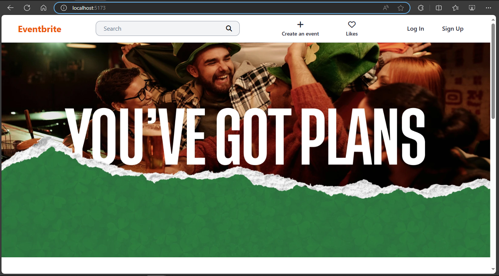
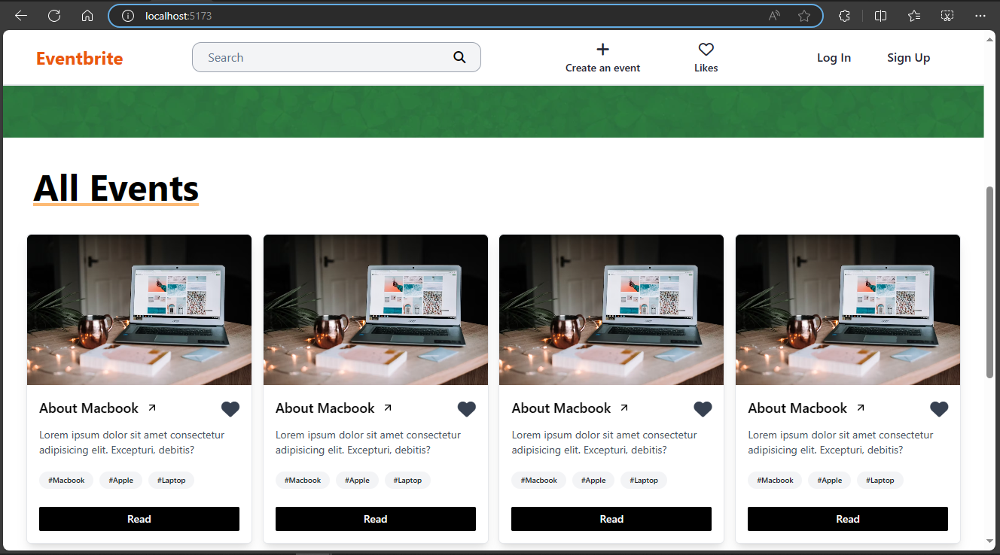
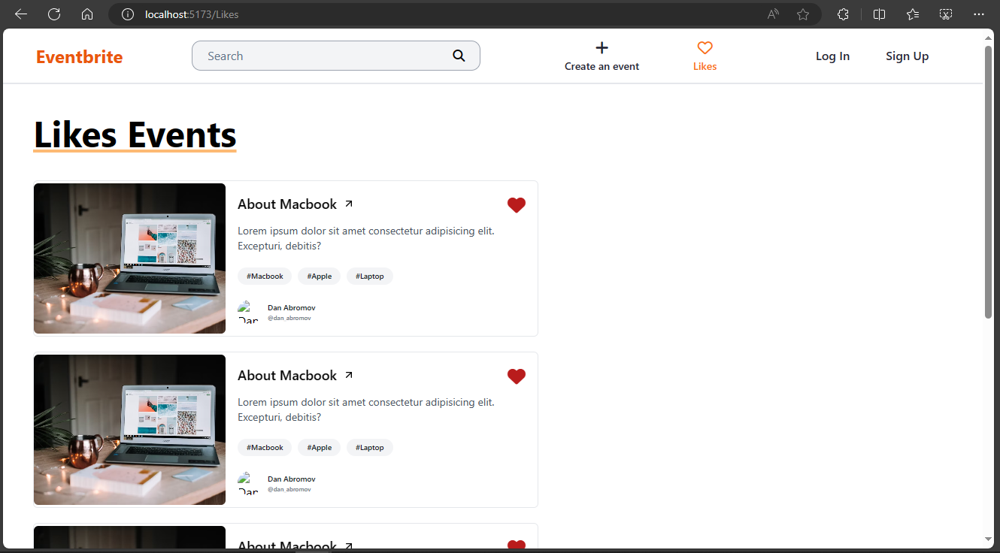
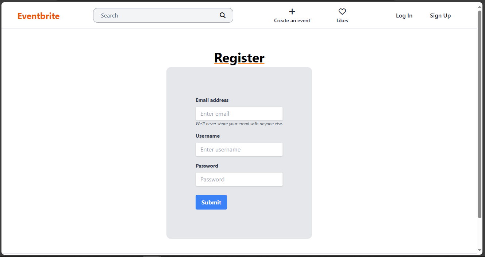
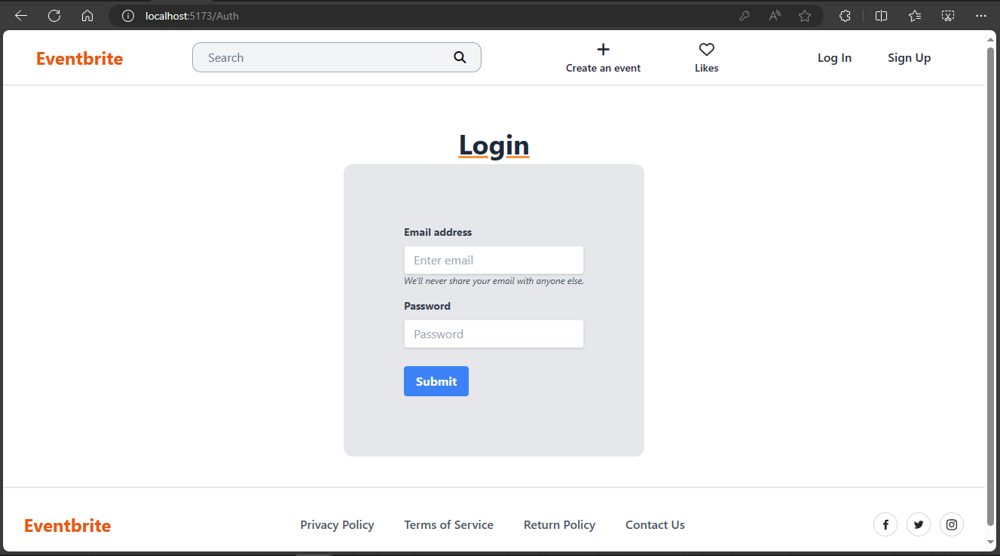

# Eventbrite


## Screenshots

### Home page



### Home footer



### Like page



### Register page



### Login page



# Run Locally

## Step 1

### Clone this repo

```bash
git clone https://github.com/Himanshuch8055/Ignis-Tech-Solutions-Internship-project.git
```

## Step 2

### Install dependencies

### Frontend (ReactJs)

To run frontend navigate to frontend folder using this command

```bash
  cd frontend
```

Now run this command to install "node_modules" and all "dependencies" to run the frontend

```bash
  npm install
```

Now run

```bash
  npm run dev
```

Navigate to

```bash
  http://localhost:5173/
```

Your frontend will start now move to backend. To backend make sure MySql database and Python install no your system.

## Backend (Django Rest Framework)

Install my-project with npm

```bash
  python -m django startproject my-project
  cd my-project
  python manage.py runserver
```

## Tech Stack

**Client:** React, TailwindCSS

**Server:** Python, Django Rest Framework

## Feedback

If you have any feedback, please reach out to us at himanshuch8055@gmail.com
